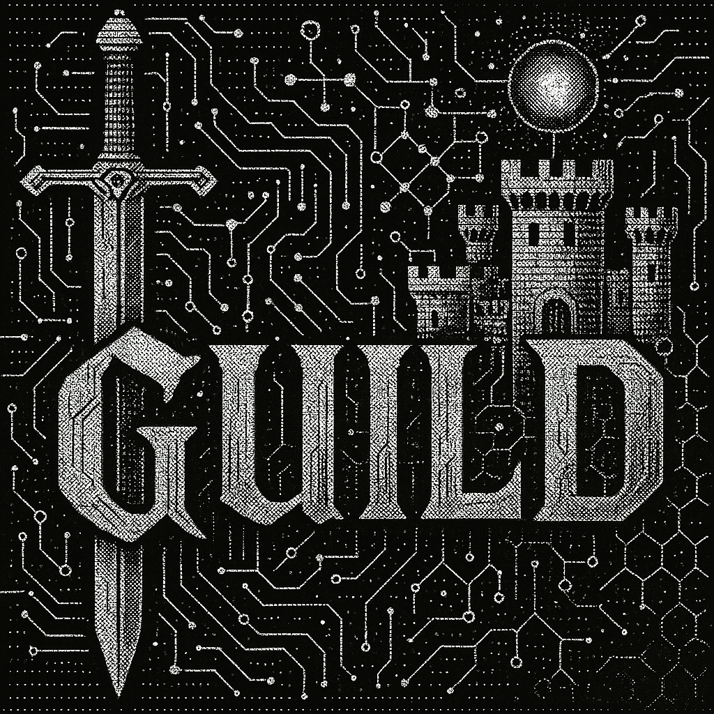

# Guild: Collaborative AI Agent Framework

  
    
  <strong>Orchestrate specialized AI agents working together in medieval-themed guilds</strong>
    

---

> ⚠️ **Guild is under active development and not yet ready for public use.**
>
> This project is being shared early to demonstrate ongoing work on a deeply modular AI orchestration system I started working on in March 2025. Many systems are incomplete or experimental.

---

## 🏰 What Is Guild?

**Guild** is a collaborative, AI agent framework built in Go for increasing the amount of AI agents a single person can direct productively. Inspired by medieval guilds and corporate org structures.

I started building Guild to better understand agentic systems and as an agent framework with an easier to comprehend mental model of the concepts required to orchestrate agents.

It evolved into a research and exploration project into how I, as a single person, could manage and direct hundreds, or even thousands of agents towards a single multi faceted purpose.  Essentially how can I build a single tool, that enables myself and other users to become the CEO of a 24/7 agent team, where each agent has the same capabilities as a similarly sized team of humans using currently available AI tools.

The research is ongoing but results are 

**Core Components:**

- **Agent Framework**: Flexible system for defining AI agents with specialized capabilities, tools, and behaviors
- **Orchestration Engine**: Coordinates multiple agents, managing task dependencies and inter-agent communication via gRPC
- **Memory Layer**: SQLite-based persistence with vector search capabilities for maintaining context across sessions
- **Prompt Management**: Multi-layer prompt system enabling dynamic behavior customization while maintaining efficiency
- **Task Management**: Kanban-style board for tracking work items and managing human review requirements
- **Hierarchical org structure**: Managers of managers approach
- **Accountability, Auditing and Visibility**: Fest cli gives full visibility into the actions agents will take before they take it, and full tracking enabling comparison to the exact plan they were given. This gives humans the ability to answer questions about what and why things were done a certain way, and to catch mistakes the agents were going to make before the mistakes are made.

### Why the Medieval Theme?

The medieval guild theme serves a purpose beyond aesthetics:

- **Guilds** = Configurable agent teams with specialized capabilities
- **Commissions → Festivals** = Work assignments that evolved into hierarchical project planning methodology (via Fest CLI)
- **Festivals** = AI-driven planning that breaks down high level goals into a hierarchy of smaller goals, all the way down to individual task
- **Corpus** = Collaborative knowledge base where humans and agents share domain expertise. Agents add context as they work; humans use the corpus agent to translate agent knowledge into human-readable format
- **Campaigns** = Agentic workspaces containing configs, resources, task definitions, and everything needed to customize and run the system in way that YOU think will produce the best results

The goal: Lower the cognitive load associated with building highly capable AI automation systems

--

Guild is built as a modular, extensible framework for orchestrating multiple AI agents working together on complex tasks. The architecture emphasizes:

## **The Guild Metaphor**

- Makes complex multi-agent concepts more intuitive
- Provides a consistent mental model for system components
- Adds personality to what could be a dry technical framework

The goal is serious engineering wrapped in an approachable, memorable package.

---

## 🔧 Project Status

Guild is R&D. Core infrastructure is in place, but many commands and systems are incomplete or non-functional. The project is being opened publicly to:

- Share development progress
- Get feedback and issue reports
- Allow early supporters to follow along
- Begin building a contributor community if other people find this interesting.

---

## Notable Results & Insights

## [Festival Methodology](https://github.com/lancekrogers/festival-methodology)

I've been using and refining guild's project planning and task assignment system daily since early May 2025 on dozens of personal and professional projects.

Decreased human effort in planning multi-step, hierarchical planning specs from 1-2 weeks in June to 2-3 days In October and down to 30 minutes in December.

The fest cli orchestration features decreased my token usage by >90% by reducing itteration via templating and just in time context injection.

Festival plans work consistently with all models and model providers.  Results rarely require any human intervention and the difference between model intelligence is in speed to complete the festival.  Quality gates ensure that agents fix their own mistakes early, before they compound into a mess.

## Exponential Producivity Increase

I published a [blog post](https://blockhead.consulting/blog/1_million_per_week_with_claude_code) on June 15th 2025 where I measured my output over 7 weeks using the COCOMO software cost estimation model.
My theory wasn't about value estimation, but that I could use COCOMO to measure my personal productivity increases with different tools and techniques over time.

At the time with my initial guild inspired workflow, I was able to produce high quality, niche, greenfield codebases with a COCOMO cost estimate of $142,000 per day.  This is compared to $6500 per day pre-chatgpt, $9,000 per day post chatgpt.

On January 8th 2026, my daily COCOMO estimated value following the same criteria from June has increased by 28x to $4,000,000 COCOMO cost estimate per day.

When I started guild I thought the useful limit of what I was trying to build would cap out at about where I am now, but now the path to doubling the productive growth rate again seems like a simple UX problem and the use case is clear. Still falls under the abstraction of a very large company.

Beyond that is where things could get very interestin

## Best model moat is a myth

The results of using festival methodology, prove that breaking complex goals down into actionable, hierarchical task, is more important and more effective than increasing context window size or building more capable models.

Using guild inspired campaigns and festivals, has proven to be consistenlty be more effective than an increase in model capability. My personal productivity does correlate with increases in models, but the rate of change jumps exponentially faster due to improvements to guild based infra and tooling. In many cases, I've noticed exponential increases in my personal productivity multiple times per day as I start using and refining new tools.

--- 

## 📜 License

Guild is **source available**.

It is licensed under a custom [Angry Goat License](LICENSE), which means:

- ✅ Personal, educational, and non-commercial use is allowed
- ❌ Commercial use (SaaS, resale, internal enterprise, etc.) is **prohibited** without a commercial license
- 🔒 Redistribution, forking, and repackaging are not allowed
- 💼 If you'd like to use Guild commercially, email [lance@blockhead.consulting](mailto:lance@blockhead.consulting)

*Guild is shared as a research artifact and portfolio piece. Development priorities shift based on exploration rather than user demand. Systems may be rebuilt, deleted, or evolve significantly.*
