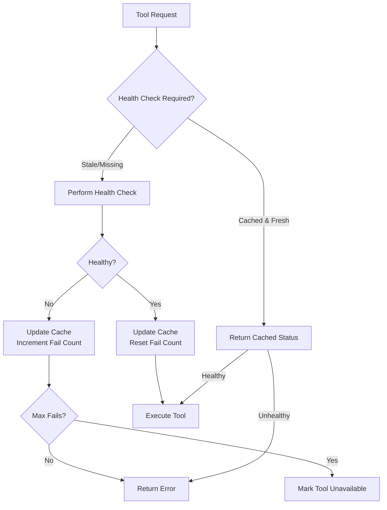

# Tool Health Monitoring

## Overview

The Guild Framework implements a comprehensive health monitoring system for tools to ensure reliability and prevent cascading failures. This system provides:

- **Health checks** - Each tool can implement custom health verification
- **Caching** - Prevents excessive health checks from impacting performance
- **Observability** - Metrics and logging for monitoring tool health
- **Circuit breaking** - Automatic tool disabling after consecutive failures
- **Background monitoring** - Continuous health status updates

## Architecture



## Implementation Guide

### 1. Basic Health Check

Every tool must implement the `HealthCheck()` method:

```go
func (t *MyTool) HealthCheck() error {
    // Verify tool dependencies are available
    if !t.isServiceAvailable() {
        return errors.New("required service unavailable")
    }
    
    // Check configuration is valid
    if err := t.validateConfig(); err != nil {
        return fmt.Errorf("invalid configuration: %w", err)
    }
    
    // Tool is healthy
    return nil
}
```

### 2. Health Check Best Practices

#### Quick Checks

Health checks should complete quickly (< 5 seconds):

```go
func (t *DatabaseTool) HealthCheck() error {
    ctx, cancel := context.WithTimeout(context.Background(), 3*time.Second)
    defer cancel()
    
    // Simple connectivity check
    return t.db.PingContext(ctx)
}
```

#### Meaningful Verification

Check actual functionality, not just existence:

```go
func (t *FileTool) HealthCheck() error {
    // ❌ Bad: Only checks path exists
    // _, err := os.Stat(t.basePath)
    
    // ✅ Good: Verifies read/write permissions
    testFile := filepath.Join(t.basePath, ".health_check")
    if err := os.WriteFile(testFile, []byte("test"), 0644); err != nil {
        return fmt.Errorf("cannot write to base path: %w", err)
    }
    defer os.Remove(testFile)
    
    if _, err := os.ReadFile(testFile); err != nil {
        return fmt.Errorf("cannot read from base path: %w", err)
    }
    
    return nil
}
```

#### Graceful Degradation

Consider partial functionality:

```go
type APITool struct {
    primary   *APIClient
    fallback  *APIClient
}

func (t *APITool) HealthCheck() error {
    primaryErr := t.primary.Ping()
    fallbackErr := t.fallback.Ping()
    
    if primaryErr != nil && fallbackErr != nil {
        return fmt.Errorf("all endpoints unavailable")
    }
    
    // Tool can function with at least one endpoint
    return nil
}
```

### 3. Using the Health Checker

#### Basic Usage

```go
// Create a health checker
checker := tools.NewHealthChecker()

// Check tool health before use
if err := checker.CheckHealth(ctx, tool); err != nil {
    log.Printf("Tool %s is unhealthy: %v", tool.Name(), err)
    return err
}

// Tool is healthy, proceed with execution
result, err := tool.Execute(ctx, input)
```

#### With Middleware

```go
// Wrap tools with automatic health checking
registry := tools.NewToolRegistry()
checker := tools.NewHealthChecker()

// Apply health check middleware to all tools
middleware := tools.HealthCheckMiddleware(checker)
wrappedTool := middleware(originalTool)

// Health check happens automatically on Execute
result, err := wrappedTool.Execute(ctx, input)
```

#### Background Monitoring

```go
// Start background health monitoring
bgChecker := tools.NewBackgroundHealthChecker(registry, 1*time.Minute)
bgChecker.Start(ctx)
defer bgChecker.Stop()

// Get health report
report := bgChecker.GetHealthReport()
fmt.Printf("Healthy: %d/%d tools\n", report.HealthyTools, report.TotalTools)
```

## Configuration

### Environment Variables

```bash
# Health check intervals
GUILD_HEALTH_CHECK_INTERVAL=30s      # How often to check health
GUILD_HEALTH_CHECK_TIMEOUT=5s        # Timeout for individual checks
GUILD_HEALTH_CHECK_MAX_FAILS=3       # Consecutive failures before marking unhealthy

# Background monitoring
GUILD_HEALTH_MONITOR_ENABLED=true    # Enable background monitoring
GUILD_HEALTH_MONITOR_INTERVAL=60s    # Background check interval
```

### Per-Tool Configuration

```go
// Configure health checker for specific requirements
checker := tools.NewHealthChecker()
checker.SetCheckInterval(10 * time.Second)  // More frequent checks
checker.SetTimeout(2 * time.Second)         // Faster timeout
checker.SetMaxConsecutiveFails(5)           // More tolerance
```

## Monitoring

### Metrics

The health system emits the following metrics:

| Metric | Type | Description | Tags |
|--------|------|-------------|------|
| `tool.health_check.success` | Counter | Successful health checks | tool, category |
| `tool.health_check.failed` | Counter | Failed health checks | tool, category |
| `tool.health_check.response_time_ms` | Histogram | Health check duration | tool, category |
| `tool.consecutive_failures` | Gauge | Current consecutive failure count | tool |

### Logging

Health check events are logged with structured fields:

```json
{
  "level": "warn",
  "component": "tools.health",
  "operation": "CheckHealth",
  "tool": "web_scraper",
  "consecutive_fails": 3,
  "response_time_ms": 5234,
  "error": "connection timeout",
  "message": "Tool has multiple consecutive health check failures"
}
```

### Alerts

Recommended alerts:

1. **Tool Unavailable** - Fire when consecutive_fails >= threshold
2. **Slow Health Checks** - Fire when response_time > 5s
3. **High Failure Rate** - Fire when failure rate > 10% over 5 minutes

## Integration

### gRPC Service

The MCP gRPC service exposes health status:

```protobuf
service MCPService {
    rpc CheckToolHealth(ToolHealthRequest) returns (ToolHealthResponse);
}
```

### REST API

Health endpoint for monitoring:

```bash
GET /api/v1/tools/{toolId}/health

Response:
{
  "healthy": true,
  "lastChecked": "2024-01-15T10:30:00Z",
  "responseTimeMs": 150,
  "consecutiveFails": 0
}
```

### Kubernetes Integration

Use liveness/readiness probes:

```yaml
livenessProbe:
  httpGet:
    path: /healthz
    port: 8080
  initialDelaySeconds: 30
  periodSeconds: 10

readinessProbe:
  httpGet:
    path: /ready
    port: 8080
  initialDelaySeconds: 5
  periodSeconds: 5
```

## Troubleshooting

### Common Issues

1. **Flapping Health Status**
   - Increase check interval
   - Add jitter to prevent thundering herd
   - Review health check implementation

2. **False Positives**
   - Ensure health check timeout is appropriate
   - Check for transient network issues
   - Implement retry logic in health check

3. **Performance Impact**
   - Enable caching
   - Increase cache duration
   - Use background monitoring instead of inline checks

### Debug Commands

```bash
# Check tool health manually
guild tools health --tool=web_scraper

# View health report
guild tools health --report

# Clear health cache
guild tools health --clear-cache

# Monitor health in real-time
guild tools health --watch
```

## Future Enhancements

1. **Adaptive Health Checks** - Adjust frequency based on failure patterns
2. **Dependency Mapping** - Understand tool dependencies for cascade prevention
3. **Predictive Health** - Use ML to predict failures before they occur
4. **Custom Health Metrics** - Allow tools to report custom health indicators
5. **Integration with APM** - Send health data to application performance monitoring

## References

- [Site Reliability Engineering: Health Checking](https://sre.google/sre-book/monitoring-distributed-systems/)
- [Circuit Breaker Pattern](https://martinfowler.com/bliki/CircuitBreaker.html)
- [Health Check Response Format for HTTP APIs](https://tools.ietf.org/html/draft-inadarei-api-health-check-06)
