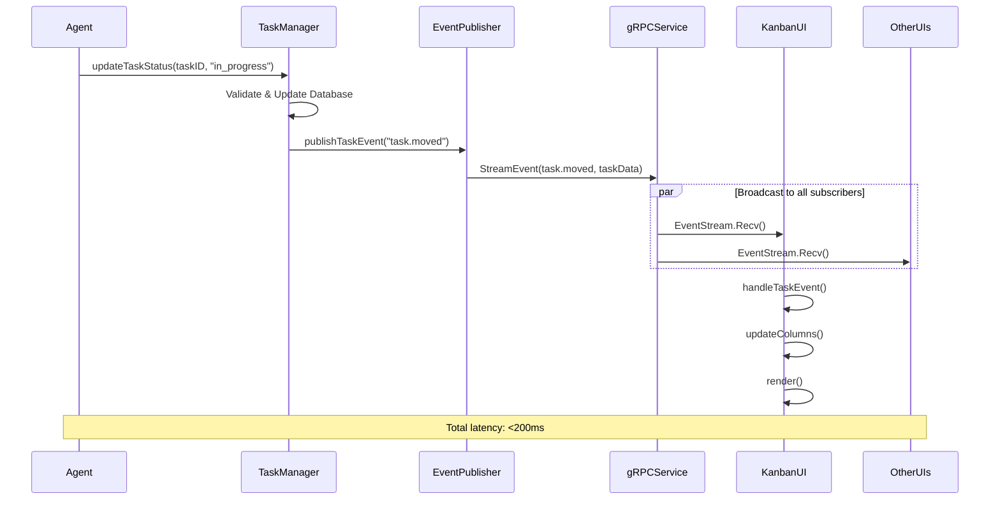

# Kanban Event Flow Architecture

This document describes the event-driven architecture that enables real-time updates in Guild's kanban system, providing sub-200ms latency for task state changes and smooth coordination across multiple agents and UI instances.

## Overview

Guild's kanban system is built on an event-driven architecture that ensures real-time synchronization between:

- Multiple kanban UI instances
- Agent actions and task state changes
- Background processes and external integrations
- Human review workflows

The architecture achieves the performance targets demonstrated in our benchmarks:

- **<200ms update latency** from action to UI display
- **>5000 events/second** throughput
- **30+ FPS** UI responsiveness with 200+ tasks

## Architecture Components

### 1. Event Generation Layer

#### Task Event Publishers (`pkg/kanban/task_event_publisher.go`)

- **Purpose**: Generate events when task state changes occur
- **Event Types**:
  - `task.created` - New task added to board
  - `task.moved` - Task status/column changed
  - `task.updated` - Task properties modified
  - `task.assigned` - Task assigned to agent
  - `task.blocked` - Task blocked with reason
  - `task.unblocked` - Task unblocked and resumed
  - `task.completed` - Task marked as done

#### Board Event Managers (`pkg/kanban/event_manager.go`)

- **Purpose**: Coordinate board-level events and state changes
- **Responsibilities**:
  - Aggregate task events into board-level changes
  - Manage event subscriptions and routing
  - Handle event ordering and deduplication

### 2. Event Distribution Layer

#### gRPC Event Service (`pkg/grpc/pb/guild/v1/events.proto`)

- **Purpose**: High-performance event streaming between components
- **Protocol**: gRPC streaming for low-latency, reliable delivery
- **Features**:
  - Bidirectional streaming
  - Event filtering by type and board
  - Connection management and reconnection
  - Event buffering and replay capabilities

#### Event Router

- **Purpose**: Route events to appropriate consumers
- **Routing Logic**:
  - Board-specific filtering (events only sent to relevant boards)
  - Component-specific subscriptions (UI vs. background processing)
  - Event type filtering (subscribe to specific event categories)

### 3. Event Consumption Layer

#### Kanban UI Event Handler (`internal/ui/kanban/model.go`)

- **Purpose**: Convert events into UI state changes
- **Process Flow**:
  1. Receive event via gRPC stream
  2. Validate event relevance (correct board, valid format)
  3. Update internal task cache
  4. Trigger UI re-render
  5. Update visual indicators (status messages, animations)

#### Agent Event Processors

- **Purpose**: Enable agents to react to task state changes
- **Use Cases**:
  - Automatically start work when tasks become unblocked
  - Notify agents of new assignments
  - Update agent workload tracking

## Event Flow Sequence

### Typical Task State Change Flow



### Event Processing Pipeline

#### 1. Event Creation (0-5ms)

```go
// Task state change triggers event
event := &TaskEvent{
    Type:      "task.moved",
    TaskID:    taskID,
    BoardID:   boardID,
    Timestamp: time.Now(),
    Data: map[string]interface{}{
        "from_status": "todo",
        "to_status":   "in_progress",
        "agent":       agentID,
    },
}
```

#### 2. Event Publishing (5-20ms)

```go
// Publisher validates and broadcasts
if err := publisher.PublishTaskEvent(ctx, event); err != nil {
    return gerror.Wrap(err, gerror.ErrCodeInternal, "failed to publish task event").
        WithComponent("kanban.publisher").
        WithOperation("PublishTaskEvent")
}
```

#### 3. Event Distribution (20-50ms)

```go
// gRPC streaming to all connected clients
for _, client := range eventService.getConnectedClients() {
    if client.subscribesTo(event.Type) && client.matchesBoard(event.BoardID) {
        client.stream.Send(&pb.TaskEvent{
            Type:    event.Type,
            TaskId:  event.TaskID,
            BoardId: event.BoardID,
            Data:    event.Data,
        })
    }
}
```

#### 4. UI Processing (50-150ms)

```go
// UI receives and processes event
func (m *Model) handleTaskEvent(event taskEventMsg) {
    switch event.eventType {
    case "task.moved":
        m.statusMessage = fmt.Sprintf("📦 Task moved from %s to %s", 
            getStringFromMap(event.data, "from_status"),
            getStringFromMap(event.data, "to_status"))
        m.scheduleReload()
    }
}
```

#### 5. Visual Update (150-200ms)

```go
// UI re-renders with new state
func (m *Model) View() string {
    // Update performance optimizations kick in
    start := time.Now()
    view := m.renderOptimized()
    renderTime := time.Since(start)
    
    // Target: <16.67ms for 60 FPS smoothness
    return view
}
```

## Performance Optimizations

### 1. Event Batching and Debouncing

**Problem**: Rapid successive events can overwhelm the UI
**Solution**: Intelligent batching and debouncing

```go
// Debounce rapid updates
func (m *Model) scheduleReload() {
    if time.Since(m.lastUpdate) > 500*time.Millisecond {
        m.lastUpdate = time.Now()
        // Trigger actual reload
    }
}
```

### 2. Viewport Culling

**Problem**: Rendering 200+ cards impacts performance
**Solution**: Only render visible cards

```go
// Only process visible cards in viewport
func (m *Model) updateColumns() {
    for i := range m.columns {
        // Apply viewport window
        start := m.columns[i].ScrollOffset
        end := start + m.viewportState.VisibleRows
        
        if start < len(filteredTasks) {
            m.columns[i].Tasks = filteredTasks[start:end]
        }
    }
}
```

### 3. Render Caching

**Problem**: Re-rendering identical cards wastes cycles
**Solution**: Cache rendered card content

```go
// Cache frequently accessed card renders
type OptimizedCardRenderer struct {
    cache *CompactCardCache
}

func (r *OptimizedCardRenderer) RenderCard(ctx context.Context, task *kanban.Task, width int, selected bool) (string, error) {
    cacheKey := fmt.Sprintf("%s:%d:%t", task.ID, width, selected)
    
    if cached, err := r.cache.GetCard(ctx, cacheKey); err == nil {
        return cached.RenderedContent, nil
    }
    
    // Render and cache
    content := r.renderCardContent(task, width, selected)
    r.cache.AddCard(ctx, &CachedCard{
        ID:              cacheKey,
        RenderedContent: content,
        CachedAt:        time.Now(),
    })
    
    return content, nil
}
```

### 4. Virtual Windowing

**Problem**: Managing 1000+ tasks in memory is inefficient
**Solution**: Virtual windowing with smart loading

```go
// Virtual window for large task lists
type VirtualWindow struct {
    windowSize int
    centerCard int
    cards      []*kanban.Task
}

func (vw *VirtualWindow) LoadWindow(ctx context.Context, allTasks []*kanban.Task, center int) error {
    start := max(0, center-vw.windowSize/2)
    end := min(len(allTasks), center+vw.windowSize/2)
    
    vw.cards = allTasks[start:end]
    vw.centerCard = center
    
    return nil
}
```

## Error Handling and Resilience

### 1. Connection Recovery

**Problem**: gRPC connections can fail
**Solution**: Automatic reconnection with exponential backoff

```go
// Automatic reconnection for event streams
func (m *Model) handleEventStreamError(err error) {
    m.statusMessage = "🔴 Event stream disconnected"
    
    // Schedule reconnection with backoff
    backoff := time.Duration(m.reconnectAttempts) * time.Second
    if backoff > 30*time.Second {
        backoff = 30 * time.Second
    }
    
    time.AfterFunc(backoff, func() {
        if err := m.reconnectEventStream(); err != nil {
            m.reconnectAttempts++
            m.handleEventStreamError(err)
        } else {
            m.reconnectAttempts = 0
            m.statusMessage = "🟢 Connected to event stream"
        }
    })
}
```

### 2. Event Ordering and Deduplication

**Problem**: Events can arrive out of order or duplicated
**Solution**: Timestamp-based ordering and deduplication

```go
// Event deduplication and ordering
type EventBuffer struct {
    events map[string]*TaskEvent // eventID -> event
    window time.Duration
}

func (eb *EventBuffer) AddEvent(event *TaskEvent) bool {
    eventID := fmt.Sprintf("%s:%s:%d", event.Type, event.TaskID, event.Timestamp.UnixNano())
    
    // Check for duplicate
    if _, exists := eb.events[eventID]; exists {
        return false // Duplicate, ignore
    }
    
    eb.events[eventID] = event
    return true
}
```

### 3. Graceful Degradation

**Problem**: High load can impact performance
**Solution**: Adaptive quality reduction

```go
// Reduce quality under high load
func (m *Model) adaptToLoad() {
    if m.profiler.GetCurrentFPS() < 20 {
        // Enable low quality mode
        m.SetLowQualityMode(true)
        m.statusMessage = "⚡ Performance mode enabled"
    } else if m.profiler.GetCurrentFPS() > 40 {
        // Re-enable high quality
        m.SetLowQualityMode(false)
    }
}
```

## Configuration and Tuning

### Event Service Configuration

```yaml
# guild.yaml event service settings
event_service:
  buffer_size: 1000          # Event buffer size
  batch_timeout: 10ms        # Max time to batch events
  max_clients: 100           # Max concurrent clients
  heartbeat_interval: 30s    # Keep-alive interval
  reconnect_backoff: "1s,5s,10s,30s"  # Backoff schedule
```

### UI Performance Tuning

```yaml
# guild.yaml kanban UI settings
kanban:
  max_visible_cards: 20      # Cards per column viewport
  render_cache_size: 500     # Cached card renders
  virtual_window_size: 100   # Virtual window size
  target_fps: 30             # Target frame rate
  auto_quality: true         # Adaptive quality control
```

## Monitoring and Debugging

### 1. Performance Metrics

The kanban system exports detailed performance metrics:

```go
// Performance monitoring
type KanbanMetrics struct {
    EventLatencyP95    time.Duration  // 95th percentile event latency
    RenderTimeAvg      time.Duration  // Average render time
    EventThroughput    float64        // Events per second
    MemoryUsage        int64          // Current memory usage
    CacheHitRate       float64        // Render cache hit rate
    ActiveConnections  int            // gRPC connections
    DroppedEvents      int64          // Events dropped due to overload
}
```

### 2. Debug Logging

Enable detailed event tracing:

```bash
# Enable event tracing
export GUILD_LOG_LEVEL=debug
export GUILD_TRACE_EVENTS=true

guild kanban view --debug
```

### 3. Performance Profiling

Built-in profiling for performance analysis:

```bash
# Run with profiling enabled
guild kanban view --profile

# Generate performance report
guild kanban performance-report
```

## Testing the Event Flow

### Integration Tests

Comprehensive integration tests validate the complete event flow:

```go
// Test real-time event processing
func TestKanbanRealTimeEventFlow(t *testing.T) {
    // 1. Setup kanban UI and event services
    // 2. Create task and verify UI updates
    // 3. Move task and verify real-time updates
    // 4. Test blocking/unblocking workflow
    // 5. Verify performance targets met
}
```

### Performance Benchmarks

Dedicated benchmarks verify performance claims:

```go
// Benchmark 200+ card performance
func BenchmarkDemo200Plus(b *testing.B) {
    // Test rendering performance with 200+ cards
    // Verify <200ms update latency
    // Confirm >30 FPS rendering
    // Validate memory efficiency
}
```

### Load Testing

Stress tests validate system behavior under load:

```bash
# Generate high event load
./scripts/load-test-events.sh --events-per-second 10000 --duration 60s

# Monitor performance during load
guild kanban view --performance-monitor
```

## Best Practices for Developers

### 1. Event Design

- **Use specific event types** - Prefer `task.status_changed` over generic `task.updated`
- **Include relevant context** - Add agent ID, timestamps, and relevant metadata
- **Design for idempotency** - Events should be safe to replay
- **Consider event ordering** - Events should make sense if processed out of order

### 2. Performance Considerations

- **Batch related operations** - Group multiple task updates when possible
- **Use appropriate debouncing** - Don't overwhelm the UI with rapid updates
- **Monitor memory usage** - Large event payloads can impact performance
- **Profile regularly** - Use built-in profiling to catch performance regressions

### 3. Error Handling

- **Always use context** - Propagate cancellation and timeouts
- **Handle network failures** - Events may be lost during network issues
- **Implement retries** - Critical events should be retried with backoff
- **Log comprehensively** - Include context for debugging distributed events

## Future Enhancements

### 1. Event Persistence

- Store events in SQLite for replay and audit trails
- Enable event sourcing for complete task history
- Support event replay for debugging and testing

### 2. Advanced Filtering

- Complex event filtering with boolean logic
- Geographic and temporal event filtering
- User-specific event subscriptions

### 3. External Integration

- Webhook support for external system integration
- Event export to monitoring systems
- Integration with CI/CD pipelines for build status

### 4. Performance Improvements

- WebAssembly rendering for complex visualizations
- GPU acceleration for large dataset visualization
- Predictive caching based on user behavior

---

**Related Documentation:**

- [Kanban User Guide](../kanban-user-guide.md) - End-user interface guide
- [gRPC API Reference](../daemon/PROTOBUF_API.md) - Event service API details
- [Performance Testing](../development/performance-testing.md) - Testing methodology

**Performance Targets:**

- Event latency: <200ms end-to-end
- UI responsiveness: 30+ FPS with 200+ cards
- Event throughput: >5000 events/second
- Memory efficiency: <5KB per task in memory
