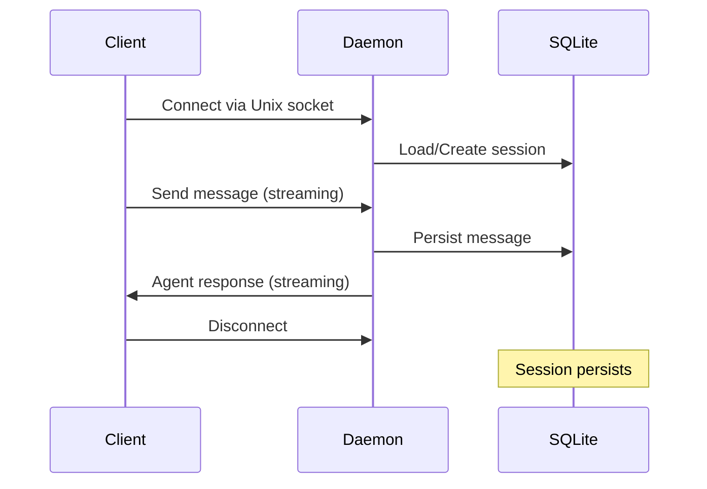
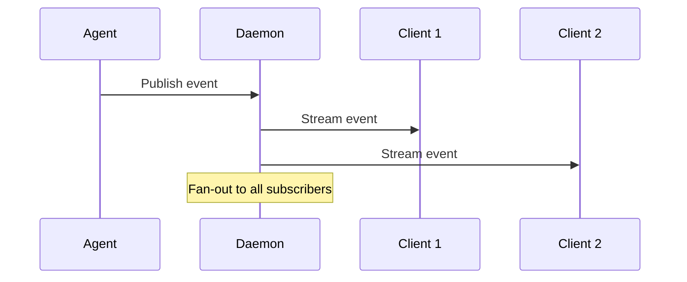

# Guild Daemon Architecture

## Overview

The Guild daemon provides persistent services for chat sessions, event streaming, and agent coordination. It exposes gRPC services over Unix sockets for high-performance local communication.

## Architecture Components

### Core Services

#### 1. Chat Service (`ChatService`)
- **Purpose**: Interactive bidirectional communication with Guild agents
- **Protocol**: gRPC streaming over Unix sockets
- **Features**:
  - Real-time agent communication
  - Session persistence across restarts
  - Tool execution coordination
  - Multi-agent conversations

#### 2. Event Service (`EventService`)
- **Purpose**: Real-time event streaming for task coordination
- **Protocol**: gRPC server-side streaming
- **Events**:
  - `task.created` - New tasks added to kanban
  - `task.updated` - Task status changes
  - `task.completed` - Task completion
  - `session.started/ended` - Chat session lifecycle
  - `agent.joined/left` - Agent participation changes

#### 3. Session Management
- **Storage**: SQLite database (`.guild/memory.db`)
- **Persistence**: Sessions and messages survive daemon restarts
- **Lifecycle**:
  1. Client connects and requests session
  2. Daemon creates or retrieves existing session
  3. Messages stream bidirectionally
  4. On disconnect, session remains in database

### Storage Layer

#### SQLite Database Schema
```sql
-- Chat sessions
CREATE TABLE sessions (
    id TEXT PRIMARY KEY,
    name TEXT NOT NULL,
    campaign_id TEXT,
    status TEXT DEFAULT 'active',
    created_at INTEGER NOT NULL,
    last_activity INTEGER NOT NULL,
    metadata TEXT -- JSON
);

-- Chat messages
CREATE TABLE messages (
    id TEXT PRIMARY KEY,
    session_id TEXT NOT NULL,
    sender_id TEXT NOT NULL,
    sender_name TEXT NOT NULL,
    content TEXT NOT NULL,
    message_type INTEGER NOT NULL,
    timestamp INTEGER NOT NULL,
    metadata TEXT, -- JSON
    FOREIGN KEY (session_id) REFERENCES sessions(id)
);
```

## Service Endpoints

### gRPC Services
- **Socket**: Unix domain socket at `/tmp/guild-{campaign}.sock`
- **Services**:
  - `guild.v1.ChatService` - Interactive chat
  - `guild.v1.GuildService` - Campaign management  
  - `prompts.v1.PromptService` - Prompt management

### Health Monitoring
- **Health Check**: gRPC `grpc.health.v1.Health` service
- **Status Endpoint**: Daemon status via `guild status` command
- **Process Management**: PID files in `.guild/` directory

## Communication Patterns

### 1. Client-Daemon Connection


### 2. Event Broadcasting


## Deployment Modes

### 1. Foreground Mode (`--foreground`)
- Interactive execution with console output
- Direct process lifecycle management
- Ideal for development and debugging

### 2. Background Mode (default)
- Daemon process detached from terminal
- Logs redirected to `.guild/daemon.log`
- PID file management for process control

### 3. Multi-Campaign Mode
- Each campaign runs independent daemon instance
- Separate Unix sockets per campaign
- Isolated storage and configuration

## Performance Characteristics

### Benchmarks
- **Target**: >5,000 events/second streaming throughput
- **Session Creation**: <100ms per session
- **Message Latency**: <10ms for local Unix socket communication
- **Concurrent Sessions**: Supports 100+ concurrent sessions

### Optimizations
- Unix domain sockets for minimal IPC overhead
- SQLite WAL mode for concurrent read/write access
- Connection pooling and reuse
- Streaming protocols to reduce round-trip latency

## Error Handling

### Graceful Degradation
- Daemon restart preserves all session data
- Client reconnection automatically restores session state
- Failed tool executions don't crash daemon
- Memory limits prevent resource exhaustion

### Recovery Mechanisms
- Automatic cleanup of stale socket files
- PID file validation and cleanup
- Database integrity checks on startup
- Connection timeout and retry logic

## Security Considerations

### Process Isolation
- Daemon runs with user permissions only
- Unix socket permissions restrict access to user
- No network exposure (local IPC only)
- Tool execution sandboxing

### Data Protection
- Session data encrypted at rest (optional)
- No sensitive data in log files
- Secure temp file handling
- Memory cleanup on shutdown

## Configuration

### Environment Variables
```bash
GUILD_DAEMON_PORT=9090          # TCP port (if enabled)
GUILD_DAEMON_SOCKET=/tmp/guild  # Socket path override
GUILD_DAEMON_LOG_LEVEL=info     # Logging verbosity
GUILD_DATABASE_PATH=.guild/memory.db  # Database location
```

### Campaign Configuration
```yaml
# guild.yaml
daemon:
  socket_path: "/tmp/guild-myproject.sock"
  log_level: "debug"
  max_sessions: 50
  session_timeout: "24h"
```

## Monitoring and Observability

### Metrics
- Active session count
- Message throughput (messages/second)
- Event streaming rate
- Database query performance
- Memory and CPU usage

### Logging
- Structured JSON logs
- Operation tracing with context IDs
- Performance timing for key operations
- Error tracking with stack traces

### Health Checks
```bash
# Check daemon status
guild status

# Verify gRPC health
grpc_health_probe -addr unix:///tmp/guild.sock

# Database integrity
sqlite3 .guild/memory.db "PRAGMA integrity_check;"
```

## Development Guide

### Local Testing
```bash
# Start daemon in foreground
guild serve --foreground

# Run integration tests
cd guild-core
make daemon-test

# Performance benchmarks
go test -bench=. ./integration/daemon/
```

### Debugging
```bash
# Enable debug logging
GUILD_DAEMON_LOG_LEVEL=debug guild serve --foreground

# Monitor database activity
tail -f .guild/daemon.log | grep -i sql

# Profile gRPC calls
GRPC_GO_LOG_VERBOSITY_LEVEL=99 guild serve --foreground
```

## Migration and Upgrades

### Database Migrations
- Automatic schema migrations on daemon startup
- Backward-compatible message format changes
- Session data preservation across upgrades
- Rollback procedures for failed migrations

### Protocol Versioning
- gRPC service versioning (`guild.v1`, `guild.v2`)
- Client-server compatibility checks
- Graceful degradation for unsupported features
- Forward-compatible message extensions