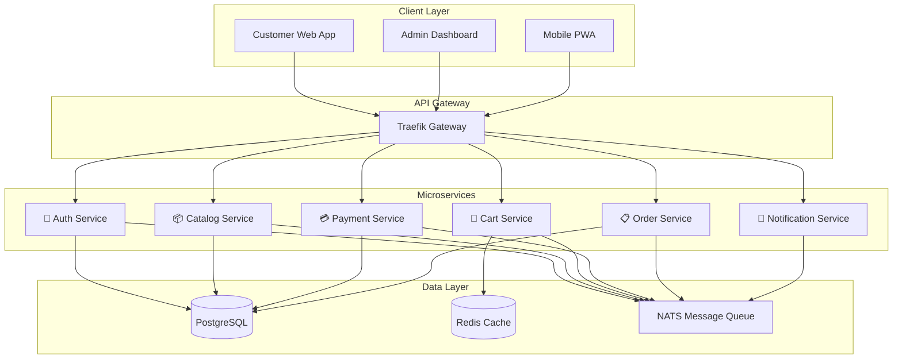

# 🛒 Modern Microservices E-commerce Platform

> **Project Objective**: Build a production-ready e-commerce platform using microservices architecture that demonstrates modern cloud-native patterns, API design, and distributed systems principles.

---

## 🎯 Project Overview

This comprehensive demo project showcases real-world software architecture while remaining accessible to developers across different experience levels. The platform will demonstrate the complexity and coordination required for modern distributed systems through a familiar e-commerce domain.

---

## 🛠 Technical Stack

### Backend Services

| Component             | Technology | Version |
| --------------------- | ---------- | ------- |
| **Language**          | Go         | 1.21+   |
| **HTTP Framework**    | Gin        | Latest  |
| **RPC Framework**     | gRPC       | Latest  |
| **Primary Database**  | PostgreSQL | 15+     |
| **Cache Layer**       | Redis      | 7+      |
| **Message Queue**     | NATS       | Latest  |
| **API Documentation** | OpenAPI    | 3.0     |

### Frontend Application

| Component        | Technology               | Version            |
| ---------------- | ------------------------ | ------------------ |
| **Language**     | TypeScript               | 5+                 |
| **Framework**    | Next.js                  | 14 with App Router |
| **Styling**      | Tailwind CSS + shadcn/ui | Latest             |
| **Server State** | React Query              | Latest             |
| **Client State** | Zustand                  | Latest             |

### Infrastructure & DevOps

| Component            | Technology             | Purpose                     |
| -------------------- | ---------------------- | --------------------------- |
| **Containerization** | Docker                 | Multi-stage builds          |
| **Development**      | Docker Compose         | Local orchestration         |
| **Production**       | Kubernetes             | Container orchestration     |
| **API Gateway**      | Traefik                | Service discovery & routing |
| **Tracing**          | Jaeger + OpenTelemetry | Distributed tracing         |
| **Metrics**          | Prometheus             | Monitoring & alerting       |

---

## 🏗 Core Services Architecture



### 🔐 Authentication Service

- **Core Features**:
  - JWT-based authentication with refresh tokens
  - OAuth2 integration (Google, GitHub)
  - Role-based access control (Customer, Admin, Vendor)
  - Password reset and email verification flows
- **Security**: Rate limiting for security endpoints

### 📦 Product Catalog Service

- **Core Features**:
  - Product CRUD with rich metadata
  - Category hierarchy management
  - Full-text search with filtering/sorting
  - Image upload with CDN integration
- **Intelligence**: Product recommendations engine
- **Inventory**: Real-time tracking with low-stock alerts

### 🛒 Shopping Cart Service

- **Session Management**: Anonymous and authenticated user support
- **Features**:
  - Real-time inventory validation
  - Cart sharing and save-for-later
  - Bulk operations and quantity updates
- **Persistence**: Redis for fast access

### 💳 Payment Processing Service

- **Integrations**: Multiple providers (Stripe, PayPal simulation)
- **Security**: Secure tokenization of payment methods
- **Features**:
  - Webhook handling for status updates
  - Refund and partial refund processing
  - Payment method management

### 📋 Order Management Service

- **Lifecycle**: `pending → paid → shipped → delivered`
- **Features**:
  - Order tracking and history
  - Invoice generation with email notifications
  - Return and exchange handling
- **Integration**: Mock shipping provider APIs

### 📧 Notification Service

- **Channels**: Email, SMS, push notifications
- **Features**:
  - Template-based messaging
  - Event-driven triggers
  - Delivery tracking with retries
- **Customization**: User preference management

---

## ✨ Feature Requirements

### 👥 Customer-Facing Features

| Category                   | Features                                                |
| -------------------------- | ------------------------------------------------------- |
| **🔍 Product Discovery**   | Browse catalogs, search, filter by price/brand/ratings  |
| **🛍 Shopping Experience** | Add to cart, wishlist, product comparison               |
| **💰 Checkout Flow**       | Guest checkout, saved payment methods, shipping options |
| **👤 Account Management**  | Profile, order history, addresses, preferences          |
| **📱 Mobile Experience**   | Full responsive design with PWA capabilities            |

### 🔧 Administrative Features

| Category                  | Features                                                 |
| ------------------------- | -------------------------------------------------------- |
| **📦 Product Management** | Add/edit products, inventory management, bulk operations |
| **📋 Order Processing**   | View orders, status updates, return handling             |
| **🎧 Customer Support**   | Customer details, order history, communication logs      |
| **📊 Analytics**          | Sales metrics, top products, customer insights           |
| **🔍 System Monitoring**  | Service health, performance metrics, error tracking      |

### 👩‍💻 Developer Experience Features

| Feature                   | Description                                 |
| ------------------------- | ------------------------------------------- |
| **📚 API Documentation**  | Interactive API explorer with code examples |
| **❤️ Health Checks**      | Comprehensive service health endpoints      |
| **📝 Structured Logging** | Correlation IDs for request tracking        |
| **📈 Metrics Collection** | Business and technical KPIs                 |
| **🚀 Local Development**  | One-command setup with Docker Compose       |

---

## 🎯 Non-Functional Requirements

### ⚡ Performance Targets

- **Response Time**: < 200ms for 95th percentile API calls
- **Concurrency**: Support 1000+ concurrent users
- **Database**: Optimized queries with proper indexing
- **Assets**: CDN integration for static content
- **Caching**: Strategic caching for frequently accessed data

### 🛡 Reliability Standards

- **Resilience**: Circuit breakers for external service calls
- **Degradation**: Graceful handling of service unavailability
- **Database**: Connection pooling with retry logic
- **Architecture**: Event-driven with eventual consistency
- **Failover**: Automated recovery for critical services

### 🔒 Security Requirements

- **Transport**: HTTPS everywhere with certificate management
- **Database**: SQL injection prevention with parameterized queries
- **Input**: Validation and sanitization of all inputs
- **API**: Rate limiting on all public endpoints
- **Headers**: Secure headers and CORS configuration
- **Secrets**: Environment-based secrets management

### 👁 Observability Features

- **Tracing**: Distributed tracing across all services
- **Logging**: Structured logs with correlation IDs
- **Metrics**: Business and technical metrics collection
- **Health**: Comprehensive health check endpoints
- **Alerts**: Error tracking and notification system

---

## 📁 Project Structure

```
ecommerce-platform/
├── 🔧 services/
│   ├── auth-service/          # 🔐 Authentication & authorization
│   ├── catalog-service/       # 📦 Product catalog & search
│   ├── cart-service/          # 🛒 Shopping cart management
│   ├── payment-service/       # 💳 Payment processing
│   ├── order-service/         # 📋 Order management
│   └── notification-service/  # 📧 Multi-channel notifications
├── 🎨 frontend/
│   ├── customer-app/          # 👥 Customer-facing Next.js app
│   └── admin-app/             # 🔧 Admin dashboard
├── 🌐 api-gateway/            # Traefik configuration
├── 📚 shared/
│   ├── go-common/             # Shared Go libraries
│   ├── proto/                 # gRPC service definitions
│   └── events/                # Event schemas
├── 🏗 infrastructure/
│   ├── docker/                # Docker configurations
│   ├── k8s/                   # Kubernetes manifests
│   └── monitoring/            # Observability stack
└── 📖 docs/
    ├── api/                   # API documentation
    └── architecture/          # System design docs
```

---

## 🚀 Development Phases

### 📅 Phase 1: Foundation (Week 1-2)

- [x] **Setup**: Project structure and development environment
- [x] **Auth**: Authentication service with JWT implementation
- [x] **Catalog**: Basic product catalog service
- [x] **Gateway**: API gateway and inter-service communication
- [x] **Frontend**: Basic UI with authentication flow

### 📅 Phase 2: Core E-commerce (Week 3-4)

- [x] **Search**: Complete product catalog with search functionality
- [x] **Cart**: Shopping cart service implementation
- [x] **Payment**: Payment processing with Stripe integration
- [x] **Orders**: Order management system
- [x] **Checkout**: Customer-facing checkout flow

### 📅 Phase 3: Advanced Features (Week 5-6)

- [x] **Notifications**: Multi-channel notification service
- [x] **Admin**: Dashboard for product/order management
- [x] **Intelligence**: Advanced search with recommendations
- [x] **Mobile**: Mobile-responsive improvements
- [x] **Performance**: Optimization and caching

### 📅 Phase 4: Production Ready (Week 7-8)

- [x] **Monitoring**: Comprehensive observability stack
- [x] **Security**: Hardening and penetration testing
- [x] **Testing**: Load testing and performance tuning
- [x] **Documentation**: Complete guides and examples
- [x] **Demo**: Sample data and user scenarios

---

## 🎯 Success Criteria

### 🔧 Technical Excellence

| Metric             | Target                        | Status     |
| ------------------ | ----------------------------- | ---------- |
| **Health Checks**  | All services passing          | ⏳ Pending |
| **Response Times** | < 200ms (95th percentile)     | ⏳ Pending |
| **Security**       | Zero critical vulnerabilities | ⏳ Pending |
| **Test Coverage**  | > 80%                         | ⏳ Pending |
| **Documentation**  | Complete API docs             | ⏳ Pending |

### 💼 Business Value

- ✅ **User Journey**: Complete browse-to-purchase flow
- ✅ **Admin Workflows**: Product and order management
- ✅ **Real-time Updates**: Inventory and order status
- ✅ **Mobile-first**: Responsive design across devices
- ✅ **Payment Processing**: Simulated with webhook handling

### 🌟 Demonstration Impact

- 🏗 **Architecture**: Modern microservices patterns
- 🎯 **Separation**: Clear service boundaries and responsibilities
- 📡 **Communication**: Event-driven messaging patterns
- 👁 **Observability**: Monitoring and logging best practices
- 🚀 **Deployment**: Production-ready configurations

---

> **💡 Impact Statement**: This project demonstrates the complexity and coordination required for modern distributed systems while remaining understandable and relevant to developers across different experience levels. Perfect for showcasing Guild's multi-agent AI framework capabilities in a real-world context.