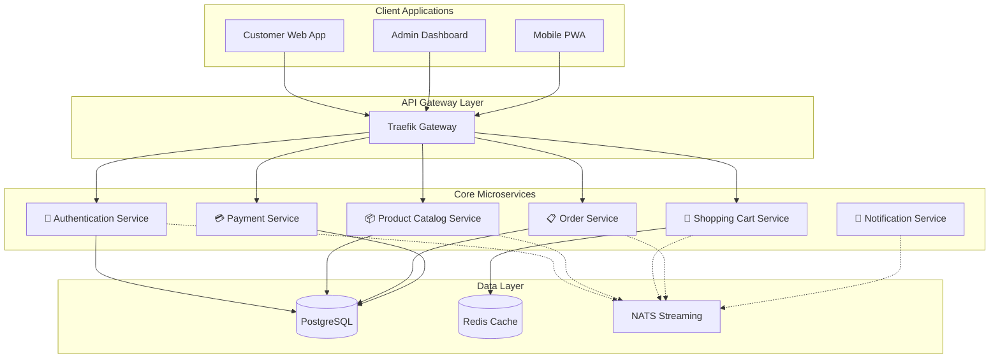

# Full Development Workflow Demo (8 minutes)

**Goal**: Complete commission → refinement → execution → review cycle demonstrating Guild's end-to-end capabilities

## Pre-Demo Setup

```bash
# Clean workspace setup
cd /path/to/demo-workspace
guild init
cp ../../.guild/commissions/e-commerce-platform.md .guild/commissions/
cp ../../.guild/guild.yaml .guild/

# Verify all agents are configured
guild agents list
```

## Act 1: Commission Analysis (0-2 minutes) 📋

### Opening: The Challenge (0-30 seconds)

**Narrator**: "Modern software development requires coordinating multiple specialists. Watch Guild transform a complex e-commerce platform requirement into executable development tasks."

**Commands**:

```bash
# Display the comprehensive commission
cat .guild/commissions/e-commerce-platform.md
```

**Key Visual Elements**:

- Rich markdown with technical specifications
- Mermaid architecture diagrams
- Professional table formatting
- Comprehensive technical requirements

### Agent Assembly (30-90 seconds)

**Commands**:

```bash
# Show configured agents and specializations
guild agents list --detailed
```

**Expected Output**:

```
🏰 Guild Agents Ready for Service

👑 @service-architect (Manager)
   ├── Specialization: System Design & Architecture
   ├── Capabilities: API design, microservices, database design
   └── Provider: Anthropic Claude-3-Sonnet

⚔️ @frontend-specialist (Worker)
   ├── Specialization: Frontend Development
   ├── Capabilities: React, TypeScript, UI design
   └── Provider: OpenAI GPT-4-Turbo

🛡️ @backend-specialist (Worker)
   ├── Specialization: Backend Development
   ├── Capabilities: Go, API development, database
   └── Provider: Anthropic Claude-3-Sonnet

🏗️ @devops-specialist (Worker)
   ├── Specialization: Infrastructure & Deployment
   ├── Capabilities: Docker, Kubernetes, CI/CD
   └── Provider: OpenAI GPT-4-Turbo

🧪 @qa-specialist (Worker)
   ├── Specialization: Quality Assurance
   ├── Capabilities: Test automation, security testing
   └── Provider: Anthropic Claude-3-Sonnet

📚 @documentation-specialist (Worker)
   ├── Specialization: Technical Documentation
   ├── Capabilities: API docs, user guides, tutorials
   └── Provider: OpenAI GPT-4-Turbo
```

### Commission Brief (90-120 seconds)

**Commands**:

```bash
guild chat --campaign e-commerce
```

**In Chat**:

```
Analyze our e-commerce commission and identify the key architectural decisions needed. @service-architect please lead this analysis.
```

## Act 2: Architectural Design (2-5 minutes) 🏗️

### System Architecture (2-3 minutes)

**Chat Commands**:

```
@service-architect Design the complete microservices architecture including API gateway, database relationships, and inter-service communication
```

**Expected Rich Response**:

```markdown
# 🏰 E-commerce Platform Architecture

## System Overview



## Core API Design

### Authentication Service APIs

```go
// Authentication endpoints
POST   /api/v1/auth/register
POST   /api/v1/auth/login
POST   /api/v1/auth/refresh
POST   /api/v1/auth/logout
GET    /api/v1/auth/profile
PUT    /api/v1/auth/profile
```

### Product Catalog APIs

```go
// Product management
GET    /api/v1/products              // List with pagination & filters
GET    /api/v1/products/:id          // Get product details
POST   /api/v1/products              // Create product (admin)
PUT    /api/v1/products/:id          // Update product (admin)
DELETE /api/v1/products/:id          // Delete product (admin)

// Search and discovery
GET    /api/v1/search                // Full-text search
GET    /api/v1/categories            // Category hierarchy
GET    /api/v1/products/featured     // Featured products
GET    /api/v1/products/recommended  // Personalized recommendations
```

## Database Schema Design

```sql
-- Core user management
CREATE TABLE users (
    id UUID PRIMARY KEY DEFAULT gen_random_uuid(),
    email VARCHAR(255) UNIQUE NOT NULL,
    password_hash VARCHAR(255) NOT NULL,
    first_name VARCHAR(100) NOT NULL,
    last_name VARCHAR(100) NOT NULL,
    role VARCHAR(50) DEFAULT 'customer',
    created_at TIMESTAMP DEFAULT NOW(),
    updated_at TIMESTAMP DEFAULT NOW()
);

-- Product catalog
CREATE TABLE categories (
    id UUID PRIMARY KEY DEFAULT gen_random_uuid(),
    name VARCHAR(100) NOT NULL,
    slug VARCHAR(100) UNIQUE NOT NULL,
    description TEXT,
    parent_id UUID REFERENCES categories(id),
    sort_order INTEGER DEFAULT 0
);

CREATE TABLE products (
    id UUID PRIMARY KEY DEFAULT gen_random_uuid(),
    name VARCHAR(255) NOT NULL,
    slug VARCHAR(255) UNIQUE NOT NULL,
    description TEXT,
    price DECIMAL(10,2) NOT NULL,
    compare_price DECIMAL(10,2),
    inventory_quantity INTEGER NOT NULL DEFAULT 0,
    track_inventory BOOLEAN DEFAULT true,
    category_id UUID REFERENCES categories(id),
    status VARCHAR(20) DEFAULT 'active',
    created_at TIMESTAMP DEFAULT NOW(),
    updated_at TIMESTAMP DEFAULT NOW()
);

-- Order management
CREATE TABLE orders (
    id UUID PRIMARY KEY DEFAULT gen_random_uuid(),
    user_id UUID NOT NULL REFERENCES users(id),
    order_number VARCHAR(20) UNIQUE NOT NULL,
    status VARCHAR(50) DEFAULT 'pending',
    subtotal DECIMAL(10,2) NOT NULL,
    tax_amount DECIMAL(10,2) DEFAULT 0,
    shipping_amount DECIMAL(10,2) DEFAULT 0,
    total_amount DECIMAL(10,2) NOT NULL,
    currency VARCHAR(3) DEFAULT 'USD',
    shipping_address JSONB,
    billing_address JSONB,
    created_at TIMESTAMP DEFAULT NOW(),
    updated_at TIMESTAMP DEFAULT NOW()
);
```

```

### Infrastructure Planning (3-4 minutes)

**Chat Commands**:
```

@devops-specialist Plan the containerization and deployment strategy for our microservices architecture

```

**Expected Response** (with Docker and Kubernetes configurations):
```markdown
# 🐳 Containerization & Deployment Strategy

## Docker Multi-Stage Build Strategy

### Service Dockerfile Template
```dockerfile
# Build stage
FROM golang:1.21-alpine AS builder
WORKDIR /app
COPY go.mod go.sum ./
RUN go mod download
COPY . .
RUN CGO_ENABLED=0 GOOS=linux go build -a -installsuffix cgo -o service ./cmd/

# Runtime stage
FROM alpine:latest
RUN apk --no-cache add ca-certificates
WORKDIR /root/
COPY --from=builder /app/service .
EXPOSE 8080
HEALTHCHECK --interval=30s --timeout=3s --start-period=5s --retries=3 \
    CMD wget --no-verbose --tries=1 --spider http://localhost:8080/health || exit 1
CMD ["./service"]
```

## Kubernetes Deployment Architecture

### Service Deployment Template

```yaml
apiVersion: apps/v1
kind: Deployment
metadata:
  name: auth-service
  namespace: ecommerce
spec:
  replicas: 3
  selector:
    matchLabels:
      app: auth-service
  template:
    metadata:
      labels:
        app: auth-service
    spec:
      containers:
      - name: auth-service
        image: ecommerce/auth-service:latest
        ports:
        - containerPort: 8080
        env:
        - name: DATABASE_URL
          valueFrom:
            secretKeyRef:
              name: database-config
              key: url
        resources:
          requests:
            memory: "64Mi"
            cpu: "50m"
          limits:
            memory: "128Mi"
            cpu: "200m"
        livenessProbe:
          httpGet:
            path: /health
            port: 8080
          initialDelaySeconds: 30
          periodSeconds: 10
        readinessProbe:
          httpGet:
            path: /ready
            port: 8080
          initialDelaySeconds: 5
          periodSeconds: 5
```

## CI/CD Pipeline Strategy

```yaml
# .github/workflows/deploy.yml
name: Deploy Microservices
on:
  push:
    branches: [main]

jobs:
  test-and-deploy:
    runs-on: ubuntu-latest
    steps:
    - uses: actions/checkout@v3

    - name: Run Tests
      run: |
        go test ./...
        docker-compose -f docker-compose.test.yml up --abort-on-container-exit

    - name: Build Images
      run: |
        docker build -t ecommerce/auth-service:${{ github.sha }} ./services/auth/
        docker build -t ecommerce/catalog-service:${{ github.sha }} ./services/catalog/

    - name: Deploy to Kubernetes
      run: |
        kubectl set image deployment/auth-service auth-service=ecommerce/auth-service:${{ github.sha }}
        kubectl rollout status deployment/auth-service
```

```

## Act 3: Implementation Planning (5-7 minutes) 💻

### Frontend Architecture (5-6 minutes)

**Chat Commands**:
```

@frontend-specialist Create the React component architecture and state management strategy for our e-commerce platform

```

**Expected Response**:
```typescript
// Core Component Architecture
// src/components/product/ProductCatalog.tsx
import React, { useState, useEffect } from 'react';
import { useQuery } from 'react-query';
import { Product, ProductFilters } from '../../types/product';
import { productApi } from '../../api/products';

export const ProductCatalog: React.FC = () => {
  const [filters, setFilters] = useState<ProductFilters>({
    category: '',
    priceRange: { min: 0, max: 1000 },
    sortBy: 'name',
    sortOrder: 'asc'
  });

  const { data: products, isLoading, error } = useQuery(
    ['products', filters],
    () => productApi.getProducts(filters),
    {
      keepPreviousData: true,
      staleTime: 5 * 60 * 1000 // 5 minutes
    }
  );

  return (
    <div className="product-catalog">
      <ProductFilters
        filters={filters}
        onFiltersChange={setFilters}
      />

      {isLoading ? (
        <ProductSkeleton count={12} />
      ) : error ? (
        <ErrorMessage message="Failed to load products" />
      ) : (
        <div className="grid grid-cols-1 md:grid-cols-3 lg:grid-cols-4 gap-6">
          {products?.data.map((product: Product) => (
            <ProductCard
              key={product.id}
              product={product}
              onAddToCart={handleAddToCart}
            />
          ))}
        </div>
      )}

      <Pagination
        current={products?.pagination.page}
        total={products?.pagination.totalPages}
        onPageChange={handlePageChange}
      />
    </div>
  );
};

// Global State Management with Zustand
import { create } from 'zustand';
import { persist } from 'zustand/middleware';

interface CartStore {
  items: CartItem[];
  total: number;
  addItem: (product: Product, quantity: number) => void;
  updateQuantity: (id: string, quantity: number) => void;
  removeItem: (id: string) => void;
  clearCart: () => void;
}

export const useCartStore = create<CartStore>()(
  persist(
    (set, get) => ({
      items: [],
      total: 0,

      addItem: (product, quantity) =>
        set((state) => {
          const existingItem = state.items.find(item => item.productId === product.id);
          if (existingItem) {
            return {
              items: state.items.map(item =>
                item.productId === product.id
                  ? { ...item, quantity: item.quantity + quantity }
                  : item
              ),
              total: calculateTotal(state.items)
            };
          }

          const newItem = { ...product, quantity, productId: product.id };
          return {
            items: [...state.items, newItem],
            total: calculateTotal([...state.items, newItem])
          };
        }),

      updateQuantity: (id, quantity) =>
        set((state) => ({
          items: state.items.map(item =>
            item.productId === id ? { ...item, quantity } : item
          ),
          total: calculateTotal(state.items)
        })),

      removeItem: (id) =>
        set((state) => ({
          items: state.items.filter(item => item.productId !== id),
          total: calculateTotal(state.items.filter(item => item.productId !== id))
        })),

      clearCart: () => set({ items: [], total: 0 })
    }),
    { name: 'cart-storage' }
  )
);
```

### Backend Service Implementation (6-7 minutes)

**Chat Commands**:

```
@backend-specialist Implement the Go backend services with proper error handling and database integration
```

## Act 4: Integration & Review (7-8 minutes) 🔄

### Commission Refinement (7-7.5 minutes)

**Commands**:

```bash
guild commission refine .guild/commissions/e-commerce-platform.md --create-tasks --assign-agents
```

**Expected Output**:

```
🏰 Guild Commission Refinement Complete

📊 Analysis Summary:
├── 🎯 6 Specialized Agents Identified
├── 🏗️ 23 Core Tasks Extracted
├── 📦 6 Microservices Planned
└── 🧪 Comprehensive Testing Strategy

✅ Task Assignment:
┌─────────────────────────────────────────────────────────────┐
│ 👑 @service-architect (5 tasks)                            │
├── API Design & Documentation                               │
├── Database Schema & Migrations                             │
├── Microservice Architecture Definition                     │
├── Inter-service Communication Protocol                     │
└── Security & Authentication Strategy                       │
└─────────────────────────────────────────────────────────────┘

┌─────────────────────────────────────────────────────────────┐
│ 🎨 @frontend-specialist (4 tasks)                          │
├── React Component Library                                  │
├── State Management Implementation                          │
├── Responsive Design & Mobile Support                       │
└── Admin Dashboard Development                              │
└─────────────────────────────────────────────────────────────┘

┌─────────────────────────────────────────────────────────────┐
│ ⚙️ @backend-specialist (6 tasks)                           │
├── Authentication Service Implementation                     │
├── Product Catalog Service                                  │
├── Shopping Cart Service                                    │
├── Order Management Service                                 │
├── Payment Integration                                      │
└── Notification Service                                     │
└─────────────────────────────────────────────────────────────┘

📁 Files Generated:
├── .guild/kanban/review/api-design.md
├── .guild/kanban/review/frontend-architecture.md
├── .guild/kanban/review/backend-services.md
├── .guild/kanban/review/deployment-strategy.md
├── .guild/kanban/review/testing-strategy.md
└── .guild/kanban/review/documentation-plan.md

🚀 Ready for development execution!
```

### Review Workflow (7.5-8 minutes)

**Commands**:

```bash
# Show generated review files
ls -la .guild/kanban/review/
cat .guild/kanban/review/api-design.md | head -20
```

**Closing Narration**: "Guild has transformed a complex commission into executable development tasks, with clear agent assignments and comprehensive review materials. This coordinated approach ensures nothing falls through the cracks in modern software development."

## Recording Notes

### Timing Breakdown

- **Act 1 (0-2min)**: Commission analysis and agent introduction
- **Act 2 (2-5min)**: Architecture design with rich technical content
- **Act 3 (5-7min)**: Implementation planning across specializations
- **Act 4 (7-8min)**: Task creation and review workflow

### Key Visual Moments

1. **Rich Commission Display**: Professional markdown rendering
2. **Agent Coordination**: Multiple specialized responses
3. **Technical Depth**: Real code, architectures, and configurations
4. **Task Generation**: Automated project breakdown
5. **Review Workflow**: File-based collaboration system

### Success Metrics

- ✅ Complete development workflow demonstrated
- ✅ All agent specializations clearly shown
- ✅ Rich technical content throughout
- ✅ Professional tool appearance maintained
- ✅ Real-world applicability evident
- ✅ Competitive advantages highlighted

This comprehensive demo showcases Guild's complete development workflow capabilities while maintaining visual appeal and professional quality throughout.
