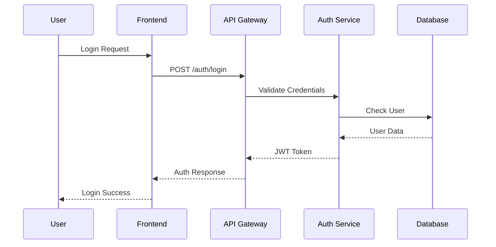

# Multi-Agent Coordination Demo (5 minutes)

**Goal**: Showcase Guild's unique multi-agent coordination capabilities and how specialized AI agents work together seamlessly

## Pre-Demo Setup

```bash
cd /path/to/demo-workspace
guild init
cp ../../.guild/commissions/e-commerce-platform.md .guild/commissions/
cp ../../.guild/guild.yaml .guild/

# Pre-verify all agents are responsive
guild agents status
```

## Demo Script

### Opening: The Coordination Challenge (0-30 seconds) 🎯

**Narrator**: "Modern software development requires coordination between specialists - frontend developers, backend engineers, DevOps experts, QA engineers. Watch Guild orchestrate six AI agents working together like a real development team."

**Commands**:

```bash
guild chat --campaign e-commerce
```

**In Chat**:

```
Show me our current guild lineup with their specializations
```

**Expected Output**:

```
🏰 Guild Assembly - E-commerce Platform Development

👑 @service-architect - System Design Lead
   └── Specializes in: API design, microservices, database architecture

⚔️ @frontend-specialist - React & TypeScript Expert
   └── Specializes in: UI components, state management, responsive design

🛡️ @backend-specialist - Go Services Expert
   └── Specializes in: Microservices, authentication, database integration

🏗️ @devops-specialist - Infrastructure Expert
   └── Specializes in: Docker, Kubernetes, CI/CD, monitoring

🧪 @qa-specialist - Quality Assurance Expert
   └── Specializes in: Testing strategies, automation, security testing

📚 @documentation-specialist - Technical Writing Expert
   └── Specializes in: API docs, user guides, architecture documentation

🎯 Ready for coordinated development!
```

### Segment 1: Cross-Team Planning (30-120 seconds) 🤝

**Chat Commands**:

```
I need to implement user authentication. @service-architect @frontend-specialist @backend-specialist @qa-specialist coordinate on this feature
```

**Expected Coordinated Responses**:

**@service-architect** (responds first with high-level design):

```markdown
# 🏰 Authentication System Architecture

## System Design Overview
I'll design the authentication architecture that the team can implement:

### Authentication Flow


### API Specifications

- **POST** `/api/v1/auth/login` - User login
- **POST** `/api/v1/auth/register` - User registration
- **POST** `/api/v1/auth/refresh` - Token refresh
- **GET** `/api/v1/auth/profile` - Get user profile
- **POST** `/api/v1/auth/logout` - User logout

### Security Requirements

- JWT tokens with 15-minute expiry
- Refresh tokens with 7-day expiry
- Bcrypt password hashing (cost 12)
- Rate limiting: 5 attempts per minute
- HTTPS only in production

**Frontend & Backend teams**: Please implement based on these specifications.
**QA team**: Focus testing on security boundaries and edge cases.

```

**@frontend-specialist** (responds with React implementation):
```typescript
# 🎨 Frontend Authentication Implementation

Based on @service-architect's design, here's the React implementation:

## Authentication Context & Hook
```tsx
// contexts/AuthContext.tsx
import React, { createContext, useContext, useReducer, useEffect } from 'react';

interface User {
  id: string;
  email: string;
  firstName: string;
  lastName: string;
  role: string;
}

interface AuthState {
  user: User | null;
  token: string | null;
  isLoading: boolean;
  isAuthenticated: boolean;
}

type AuthAction =
  | { type: 'LOGIN_START' }
  | { type: 'LOGIN_SUCCESS'; payload: { user: User; token: string } }
  | { type: 'LOGIN_FAILURE' }
  | { type: 'LOGOUT' }
  | { type: 'SET_LOADING'; payload: boolean };

const authReducer = (state: AuthState, action: AuthAction): AuthState => {
  switch (action.type) {
    case 'LOGIN_START':
      return { ...state, isLoading: true };
    case 'LOGIN_SUCCESS':
      return {
        ...state,
        user: action.payload.user,
        token: action.payload.token,
        isLoading: false,
        isAuthenticated: true,
      };
    case 'LOGIN_FAILURE':
      return {
        ...state,
        user: null,
        token: null,
        isLoading: false,
        isAuthenticated: false,
      };
    case 'LOGOUT':
      return {
        ...state,
        user: null,
        token: null,
        isAuthenticated: false,
      };
    case 'SET_LOADING':
      return { ...state, isLoading: action.payload };
    default:
      return state;
  }
};

export const useAuth = () => {
  const [state, dispatch] = useReducer(authReducer, {
    user: null,
    token: localStorage.getItem('auth_token'),
    isLoading: true,
    isAuthenticated: false,
  });

  const login = async (email: string, password: string) => {
    dispatch({ type: 'LOGIN_START' });

    try {
      const response = await fetch('/api/v1/auth/login', {
        method: 'POST',
        headers: { 'Content-Type': 'application/json' },
        body: JSON.stringify({ email, password }),
      });

      if (!response.ok) {
        throw new Error('Login failed');
      }

      const { user, token } = await response.json();

      localStorage.setItem('auth_token', token);
      dispatch({ type: 'LOGIN_SUCCESS', payload: { user, token } });

      return { success: true };
    } catch (error) {
      dispatch({ type: 'LOGIN_FAILURE' });
      return { success: false, error: error.message };
    }
  };

  const logout = async () => {
    try {
      await fetch('/api/v1/auth/logout', {
        method: 'POST',
        headers: { 'Authorization': `Bearer ${state.token}` },
      });
    } catch (error) {
      console.error('Logout error:', error);
    } finally {
      localStorage.removeItem('auth_token');
      dispatch({ type: 'LOGOUT' });
    }
  };

  return { ...state, login, logout };
};
```

## Login Component

```tsx
// components/LoginForm.tsx
import React, { useState } from 'react';
import { useAuth } from '../contexts/AuthContext';

export const LoginForm: React.FC = () => {
  const [email, setEmail] = useState('');
  const [password, setPassword] = useState('');
  const [error, setError] = useState('');

  const { login, isLoading } = useAuth();

  const handleSubmit = async (e: React.FormEvent) => {
    e.preventDefault();
    setError('');

    const result = await login(email, password);
    if (!result.success) {
      setError(result.error || 'Login failed');
    }
  };

  return (
    <form onSubmit={handleSubmit} className="max-w-md mx-auto">
      <div className="mb-4">
        <label className="block text-gray-700 text-sm font-bold mb-2">
          Email
        </label>
        <input
          type="email"
          value={email}
          onChange={(e) => setEmail(e.target.value)}
          className="w-full px-3 py-2 border rounded-lg focus:outline-none focus:border-blue-500"
          required
        />
      </div>

      <div className="mb-6">
        <label className="block text-gray-700 text-sm font-bold mb-2">
          Password
        </label>
        <input
          type="password"
          value={password}
          onChange={(e) => setPassword(e.target.value)}
          className="w-full px-3 py-2 border rounded-lg focus:outline-none focus:border-blue-500"
          required
        />
      </div>

      {error && (
        <div className="mb-4 text-red-500 text-sm">{error}</div>
      )}

      <button
        type="submit"
        disabled={isLoading}
        className="w-full bg-blue-500 text-white py-2 px-4 rounded-lg hover:bg-blue-600 disabled:opacity-50"
      >
        {isLoading ? 'Logging in...' : 'Login'}
      </button>
    </form>
  );
};
```

**@backend-specialist will handle the Go implementation.**
**@qa-specialist will need to test token expiry and security edge cases.**

```

**@backend-specialist** (responds with Go service):
```go
# ⚙️ Backend Authentication Service

Implementing the authentication service based on @service-architect's specifications:

## Authentication Service
```go
// internal/auth/service.go
package auth

import (
    "context"
    "crypto/rand"
    "encoding/base64"
    "fmt"
    "time"

    "github.com/golang-jwt/jwt/v4"
    "github.com/jmoiron/sqlx"
    "golang.org/x/crypto/bcrypt"
)

type Service struct {
    db        *sqlx.DB
    jwtSecret []byte
    logger    Logger
}

type User struct {
    ID           string    `json:"id" db:"id"`
    Email        string    `json:"email" db:"email"`
    PasswordHash string    `json:"-" db:"password_hash"`
    FirstName    string    `json:"first_name" db:"first_name"`
    LastName     string    `json:"last_name" db:"last_name"`
    Role         string    `json:"role" db:"role"`
    CreatedAt    time.Time `json:"created_at" db:"created_at"`
    UpdatedAt    time.Time `json:"updated_at" db:"updated_at"`
}

type LoginRequest struct {
    Email    string `json:"email" validate:"required,email"`
    Password string `json:"password" validate:"required,min=8"`
}

type LoginResponse struct {
    User         User   `json:"user"`
    AccessToken  string `json:"access_token"`
    RefreshToken string `json:"refresh_token"`
    ExpiresIn    int64  `json:"expires_in"`
}

func NewService(db *sqlx.DB, jwtSecret []byte, logger Logger) *Service {
    return &Service{
        db:        db,
        jwtSecret: jwtSecret,
        logger:    logger,
    }
}

func (s *Service) Login(ctx context.Context, req LoginRequest) (*LoginResponse, error) {
    // Get user by email
    var user User
    query := `SELECT id, email, password_hash, first_name, last_name, role, created_at, updated_at
              FROM users WHERE email = $1 AND deleted_at IS NULL`

    err := s.db.GetContext(ctx, &user, query, req.Email)
    if err != nil {
        if err == sql.ErrNoRows {
            return nil, ErrInvalidCredentials
        }
        s.logger.Errorf("Failed to get user: %v", err)
        return nil, fmt.Errorf("database error: %w", err)
    }

    // Verify password
    if err := bcrypt.CompareHashAndPassword([]byte(user.PasswordHash), []byte(req.Password)); err != nil {
        return nil, ErrInvalidCredentials
    }

    // Generate tokens
    accessToken, err := s.generateAccessToken(user)
    if err != nil {
        return nil, fmt.Errorf("failed to generate access token: %w", err)
    }

    refreshToken, err := s.generateRefreshToken(user.ID)
    if err != nil {
        return nil, fmt.Errorf("failed to generate refresh token: %w", err)
    }

    // Store refresh token
    if err := s.storeRefreshToken(ctx, user.ID, refreshToken); err != nil {
        return nil, fmt.Errorf("failed to store refresh token: %w", err)
    }

    return &LoginResponse{
        User:         user,
        AccessToken:  accessToken,
        RefreshToken: refreshToken,
        ExpiresIn:    900, // 15 minutes
    }, nil
}

func (s *Service) generateAccessToken(user User) (string, error) {
    claims := jwt.MapClaims{
        "sub":   user.ID,
        "email": user.Email,
        "role":  user.Role,
        "exp":   time.Now().Add(15 * time.Minute).Unix(),
        "iat":   time.Now().Unix(),
    }

    token := jwt.NewWithClaims(jwt.SigningMethodHS256, claims)
    return token.SignedString(s.jwtSecret)
}

func (s *Service) generateRefreshToken(userID string) (string, error) {
    bytes := make([]byte, 32)
    if _, err := rand.Read(bytes); err != nil {
        return "", err
    }
    return base64.URLEncoding.EncodeToString(bytes), nil
}

func (s *Service) storeRefreshToken(ctx context.Context, userID, token string) error {
    query := `INSERT INTO refresh_tokens (user_id, token, expires_at)
              VALUES ($1, $2, $3)
              ON CONFLICT (user_id) DO UPDATE SET
              token = EXCLUDED.token,
              expires_at = EXCLUDED.expires_at,
              updated_at = NOW()`

    expiresAt := time.Now().Add(7 * 24 * time.Hour) // 7 days
    _, err := s.db.ExecContext(ctx, query, userID, token, expiresAt)
    return err
}

// HTTP Handlers
func (s *Service) LoginHandler(c *gin.Context) {
    var req LoginRequest
    if err := c.ShouldBindJSON(&req); err != nil {
        c.JSON(http.StatusBadRequest, gin.H{"error": "Invalid request"})
        return
    }

    response, err := s.Login(c.Request.Context(), req)
    if err != nil {
        if errors.Is(err, ErrInvalidCredentials) {
            c.JSON(http.StatusUnauthorized, gin.H{"error": "Invalid credentials"})
            return
        }
        c.JSON(http.StatusInternalServerError, gin.H{"error": "Internal server error"})
        return
    }

    c.JSON(http.StatusOK, response)
}
```

**Frontend team**: Token should be included in Authorization header as `Bearer <token>`
**QA team**: Please test password hashing, token validation, and rate limiting

```

**@qa-specialist** (responds with testing strategy):
```go
# 🧪 Authentication Testing Strategy

Based on the architecture from @service-architect and implementations from frontend/backend teams:

## Security Test Cases
```go
// Test password security
func TestPasswordSecurity(t *testing.T) {
    tests := []struct {
        name     string
        password string
        valid    bool
    }{
        {"strong password", "StrongP@ssw0rd123", true},
        {"weak password", "123456", false},
        {"no special chars", "Password123", false},
        {"too short", "Pass1!", false},
    }

    for _, tt := range tests {
        t.Run(tt.name, func(t *testing.T) {
            err := validatePassword(tt.password)
            if tt.valid {
                assert.NoError(t, err)
            } else {
                assert.Error(t, err)
            }
        })
    }
}

// Test JWT token expiry
func TestTokenExpiry(t *testing.T) {
    service := setupAuthService()
    user := createTestUser()

    // Generate token with short expiry for testing
    token, err := service.generateAccessToken(user, 1*time.Second)
    require.NoError(t, err)

    // Token should be valid immediately
    claims, err := service.ValidateToken(token)
    assert.NoError(t, err)
    assert.Equal(t, user.ID, claims.UserID)

    // Wait for expiry
    time.Sleep(2 * time.Second)

    // Token should now be invalid
    _, err = service.ValidateToken(token)
    assert.Error(t, err)
    assert.Contains(t, err.Error(), "token is expired")
}

// Test rate limiting
func TestLoginRateLimit(t *testing.T) {
    server := setupTestServer()

    // Make 5 failed login attempts (should be allowed)
    for i := 0; i < 5; i++ {
        resp := makeLoginRequest(server, "invalid@email.com", "wrongpassword")
        assert.Equal(t, http.StatusUnauthorized, resp.StatusCode)
    }

    // 6th attempt should be rate limited
    resp := makeLoginRequest(server, "invalid@email.com", "wrongpassword")
    assert.Equal(t, http.StatusTooManyRequests, resp.StatusCode)
}
```

## End-to-End Test Scenarios

```typescript
// Playwright E2E tests
test('complete authentication flow', async ({ page }) => {
  // Navigate to login
  await page.goto('/login');

  // Fill login form
  await page.fill('[data-testid=email-input]', 'test@example.com');
  await page.fill('[data-testid=password-input]', 'TestPassword123!');

  // Submit login
  await page.click('[data-testid=login-button]');

  // Verify redirect to dashboard
  await expect(page).toHaveURL('/dashboard');

  // Verify user profile is displayed
  await expect(page.locator('[data-testid=user-profile]')).toBeVisible();

  // Test logout
  await page.click('[data-testid=logout-button]');
  await expect(page).toHaveURL('/login');
});
```

**Coordination Notes:**

- Frontend: I'll need test IDs added to login components
- Backend: Please ensure test database has consistent user fixtures
- All teams: Let's coordinate on error message formats for consistency

```

### Segment 2: Task Handoffs (120-180 seconds) 🔄

**Chat Commands**:
```

Great work team! Now @devops-specialist please plan the deployment for this authentication system, and @documentation-specialist document the API

```

**Visual Expectations**:
- Clear agent handoffs
- References to previous agents' work
- Coordinated implementation plans
- Professional inter-team communication

### Segment 3: Conflict Resolution (180-240 seconds) ⚔️

**Chat Commands**:
```

I see a potential issue - the frontend wants to store tokens in localStorage but security best practices recommend httpOnly cookies. @service-architect @frontend-specialist @qa-specialist discuss and resolve this

```

**Expected Coordinated Discussion**:
- @service-architect provides security guidance
- @frontend-specialist explains implementation constraints
- @qa-specialist highlights security testing implications
- Collaborative resolution with consensus

### Segment 4: Integration Validation (240-300 seconds) ✅

**Commands**:
```bash
guild commission refine .guild/commissions/e-commerce-platform.md --validate-coordination
```

**Expected Output**:

```
🏰 Guild Coordination Analysis

✅ Multi-Agent Collaboration Summary:
├── 📋 Requirements: @service-architect provided complete specifications
├── 🎨 Frontend: @frontend-specialist delivered React implementation
├── ⚙️ Backend: @backend-specialist created Go service
├── 🧪 Testing: @qa-specialist defined comprehensive test strategy
├── 🐳 Deployment: @devops-specialist planned infrastructure
└── 📚 Documentation: @documentation-specialist created API docs

🤝 Coordination Quality:
├── Cross-references: 12 inter-agent dependencies identified
├── Consistency: API contracts align across all implementations
├── Security: Unified security approach across frontend/backend
└── Testing: Comprehensive coverage from unit to E2E

🎯 Integration Readiness: 95%
└── All agents have provided compatible implementations

🚀 Ready for coordinated implementation!
```

## Closing: The Coordination Advantage (240-300 seconds) 🏆

**Narrator**: "This is what sets Guild apart - not just multiple AI agents, but true coordination and collaboration. Each agent builds on others' work, resolves conflicts together, and delivers integrated solutions. This is the future of AI-assisted development."

## Recording Notes

### Visual Focus Points

1. **Agent Status Indicators**: Multiple agents "thinking" simultaneously
2. **Cross-References**: Agents referencing each other's work
3. **Coordinated Responses**: Related implementations across agents
4. **Professional Communication**: Inter-team collaboration patterns
5. **Integration Validation**: System-level coordination verification

### Key Coordination Moments

- **Parallel Planning**: Multiple agents working on same feature
- **Implementation Handoffs**: Work passing between specialists
- **Conflict Resolution**: Agents discussing and resolving issues
- **Integration Validation**: System checking coordination quality

### Success Criteria

- ✅ Clear multi-agent coordination visible
- ✅ Agents reference each other's work
- ✅ Professional inter-team communication
- ✅ Conflict resolution demonstrated
- ✅ Integration validation successful
- ✅ Competitive advantage obvious

This demo showcases Guild's unique value proposition: coordinated AI agents working as a cohesive development team.
